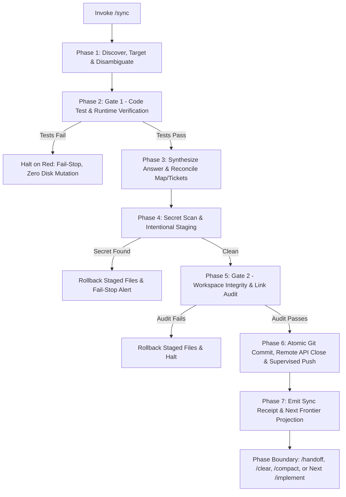

# 🔄 `/sync` — Universal End-of-Task Sync & Wayfinder Map Updating Skill

[](https://opensource.org/licenses/MIT)
[](https://github.com/mattpocock/skills)
[](https://github.com/mattpocock/skills/blob/main/skills/writing-for-agents/SKILL.md)

An agentic workflow skill for standardizing the end-of-task and end-of-session synchronization ritual. It reconciles active **Wayfinder decision maps** and issue trackers, runs two-gate verification checks, executes intentional staging and conventional commits, and projects the next actionable tasks on the frontier.

Designed for the [Matt Pocock AI Coding Workflow Suite](https://github.com/mattpocock/skills) (`/ask-matt`, `/wayfinder`, `/to-spec`, `/to-tickets`, `/implement`, `/handoff`).

---

## 🎯 Why `/sync`?

In multi-session agentic workflows, concluding a slice of work often leaves:
- Uncommitted git diffs and untracked scratch residue.
- Out-of-sync Wayfinder decision maps (`map.md`) missing recent architectural conclusions.
- Dangling issue tickets that were implemented but never formally resolved.
- Broken downstream references or unverified build states.
- Fog of war that obscures what next task is immediately ready to take.

`/sync` bridges implementation and handoff into an atomic, repeatable **Sync Ritual**.

---

## 🏗️ The 7-Phase Sync Lifecycle



### Core Leading Words
- **`sync`**: Reconciling working tree changes with project maps, tickets, and docs.
- **`drain`**: Clearing uncommitted diffs, resolved ticket state, and dirty context before leaving.
- **`receipt`**: The concise output summary (Commit SHA, test status, closed tickets, next tasks).
- **`frontier`**: The unblocked, ready-to-take tickets surfaced for the next turn/session.
- **`fog`**: The in-scope but un-ticketed territory in `Not yet specified` that shrinks as decisions graduate.

---

## 🚦 Two-Gate Verification Invariant

To ensure repository invariants and prevent split-brain state, `/sync` enforces **two distinct verification gates**:

1. **Gate 1 (Code & Runtime Tests)**: Runs *before* any ticket or map files are touched on disk. If `pytest`, `npm test`, or `just test` fails, `/sync` halts immediately with **zero disk mutations**.
2. **Gate 2 (Workspace & Link Integrity Audit)**: Runs *after* staging ticket answers and `map.md` updates. Checks that all new markdown links, schema contracts, and formatting are strictly valid before authorizing `git commit`.

---

## 🧭 Multi-Tracker Compatibility Matrix

`/sync` automatically reads `docs/agents/issue-tracker.md` (configured via `/setup-matt-pocock-skills`) to adapt to your workspace:

| Tracker Mode | Target Artifacts | Resolution Protocol |
| :--- | :--- | :--- |
| **Local Markdown (Wayfinder)** | `.scratch/<effort>/map.md`<br>`.scratch/<effort>/issues/*.md` | Synthesizes `## Answer`, marks `Status: resolved`, appends gist + link to `## Decisions so far`, and calculates unblocked frontier tickets. |
| **Local Markdown (Tracer)** | `.scratch/<feature>/issues/*.md` | Marks ticket `Status: resolved` and unblocks downstream tickets based on `Blocked by:` edges. |
| **GitHub Issues** | `gh issue list`<br>`gh issue close` | Extracts structured JSON safely, prepares commit message, commits, and atomically closes GitHub issue via `gh issue close <id> --comment "<answer>"`. |
| **GitLab Issues** | `glab issue close` | Closes issue via GitLab CLI after commit verification. |
| **Ad-hoc / Maintenance** | `CONTEXT.md`, `docs/adr/` | Reconciles glossary terms and ADRs without creating fake tickets. |

---

## 🚫 What `/sync` Does Not Do

- **It is not an implementation or code generation skill.** It does not write application features or fix broken business logic. Use `/implement` or `/tdd` to build.
- **It does not bypass failing verification gates.** If `pytest`, `npm test`, or `just test` fails, `/sync` halts immediately with **zero disk mutations** (Gate 1 fail-stop).
- **It is not a replacement for `/handoff`.** `/sync` commits verified workspace changes, resolves tickets, and updates decision maps; `/handoff` packages deep in-flight conversational reasoning across separate agent sessions.
- **It does not manufacture fake tickets.** In workspaces without an active Wayfinder map or issue tracker, it operates cleanly in **Ad-hoc / Maintenance mode**, updating glossaries (`CONTEXT.md`) or offering ADRs without polluting project state.
- **It never commits credentials or reflection residue.** It strictly excludes reflection sessions (`.scratch/reflection-session/`), temporary logs, and credential patterns.

---

## 📦 Installation & Setup

### Option A: [skillshare](https://github.com/runkids/skillshare) (Recommended)

```bash
skillshare install qu1r0ra/sync-matt --track
skillshare sync
```

### Option B: Manual Installation

#### For Antigravity (Google DeepMind)
Copy the skill folder into your Antigravity skills configuration:
```bash
mkdir -p ~/.gemini/config/plugins/matt-pocock/skills/sync
cp SKILL.md ~/.gemini/config/plugins/matt-pocock/skills/sync/SKILL.md
```

#### For Claude Code
Copy into your project or user `.claude/skills/`:
```bash
mkdir -p .claude/skills/sync
cp SKILL.md .claude/skills/sync/SKILL.md
```

#### For Cursor / Codex / Generic Agent Environments
Reference `SKILL.md` directly in your `AGENTS.md` or `.cursorrules`:
```markdown
- End of session / task sync: Read `.agents/skills/sync/SKILL.md` before committing or concluding.
```

---

## 🏁 The Sync Receipt

When complete, `/sync` emits a clean execution receipt:

```markdown
## 🏁 Sync Receipt
- **Git Commit**: `a1b2c3d` — `feat(auth): implement jwt token refresh rotation` (Local only)
- **Verification**: ✅ Gate 1 (`pytest -q`) & Gate 2 (`just audit`) passed
- **Tracker / Map Updates**:
  - Resolved: `[02-jwt-refresh.md](.scratch/auth/issues/02-jwt-refresh.md)`
  - Map Updated: `[map.md](.scratch/auth/map.md)` (`## Decisions so far` appended)
- **Staged Files**: `3 files committed`

### 🧭 Next Frontier (Ready to Take)
1. `[03-redis-session-store.md](.scratch/auth/issues/03-redis-session-store.md)` — Store refresh tokens in Redis cluster
```

---

## 📄 License

MIT © [qu1r0ra](https://github.com/qu1r0ra)
